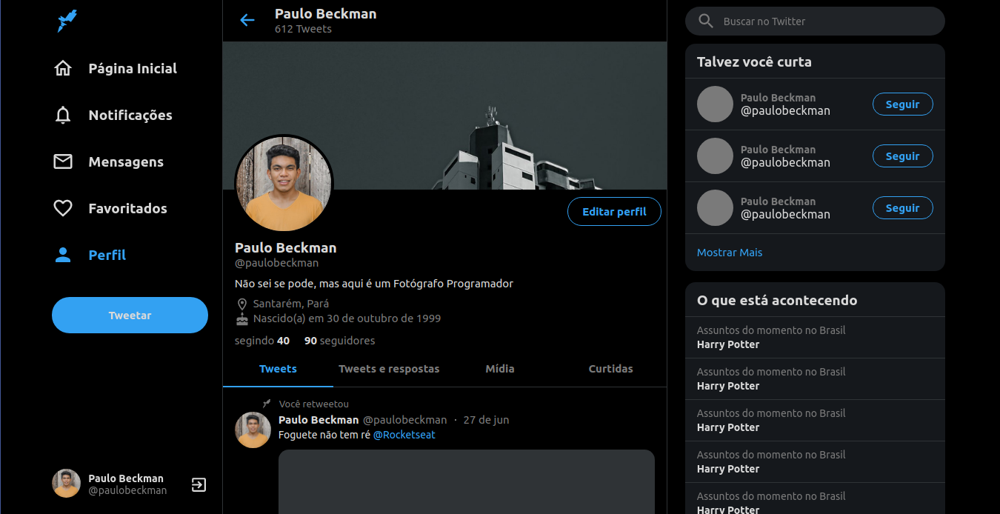

<h1 align="center">
    🚀 Clone Twitter 🚀
</h1>

<h4 align="center"> 
	🚀 Clone Twitter 🚀
</h4>
  
<p align="center">
  
  
  
  
  <a href="https://www.linkedin.com/in/paulobeckman/">
    
  </a>
	
  
  <a href="https://github.com/paulobeckman/Clone-twitter/commits/master">
    
  </a>
 
  
   <a href="https://github.com/paulobeckman/Clone-twitter/stargazers">
    
  </a>
</p>

## 🖥 Link do projeto

https://5f1391538c76d3d7322d405f--keen-pike-8e6fb7.netlify.app/


## 💻 Sobre o projeto

🐦 Clone Twitter é um projeto de clone da interface do usuário de forma responsiva do Twitter (parcial) para fins de estudo.

A responsividade foi bastante trabalhada então é possível abrir a interface no computador, tablet ou smartphone.

Esse projeto foi ensina pelo [Guilherme Rodz][gr] por meio da [Rocketseat][rs]

## 🎨 Layout

O layout da aplicação está disponível no Figma:

<a href="https://www.figma.com/file/cjNh1bd93pbJBFOza25K7L/Twitter-Clone?node-id=1%3A2">
  
</a>


### Web

<p align="center" style="display: flex; align-items: flex-start; justify-content: center;">
	
  	
		
  

</p>

## 🛠 Tecnologias

As seguintes ferramentas foram usadas na construção do projeto:

- [Node.js][nodejs]
- [CSS][css]
- [TypeScript][ts]
- [Styled Components][sc]


## 🚀 Como rodar este projeto

Podemos considerar este projeto como sendo divido em duas partes:
1. Back End (arquivos server.js, routes.js e pasta public) 

### Pré-requisitos

Antes de começar, você vai precisar ter instalado em sua máquina as seguintes ferramentas:
[Git](https://git-scm.com), [Node.js][nodejs]. 
Além disto é bom ter um editor para trabalhar com o código como [VSCode][vscode]

### 🎲 Rodando a aplicação web (Front End)

```bash
# Clone este repositório
$ git clone https://github.com/paulobeckman/Clone-twitter.git

# Acesse a pasta do projeto no terminal/cmd
$ cd Clone-twitter

# Vá para a pasta server
$ cd server

# Instale as dependências
$ yarn install

# Execute a aplicação em modo de desenvolvimento
$ npm start

# O servidor inciará na porta:3000 - acesse http://localhost:3000 
```


## 📝 Licença

Este projeto esta sobe a licença MIT. Veja a [LICENÇA](license) para saber mais.

Feito por Paulo Beckman 👋🏽 [Entre em contato!](https://www.linkedin.com/in/paulo-beckman/)

[nodejs]: https://nodejs.org/
[yarn]: https://yarnpkg.com/
[vscode]: https://code.visualstudio.com/
[license]: https://opensource.org/licenses/MIT
[CSS]: https://developer.mozilla.org/pt-BR/docs/Web/CSS
[ts]: https://www.typescriptlang.org/
[gr]: https://github.com/guilhermerodz
[rs]: https://www.youtube.com/watch?v=K-8z_4xvT3o
[sc]: https://styled-components.com/
